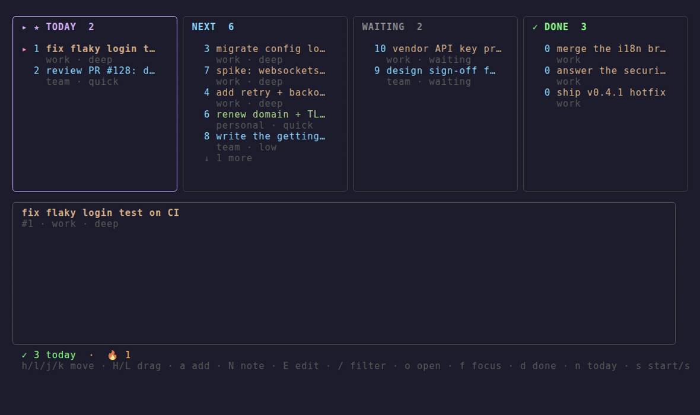

# deck

[](https://github.com/kannonski/deck/actions/workflows/ci.yml)

A kanban TUI for [dstask](https://github.com/naggie/dstask). It reads and writes
your `~/.dstask` store directly via the dstask library (no subprocess), so it stays
in sync with the `dstask` CLI.

Columns: **TODAY** (`+now`) · **NEXT** (the actionable pool, `P3` hidden) ·
**WAITING** (`+waiting`) · **DONE** (resolved today). A bottom pane shows the
selected task's source link, its notes, and — if configured — a generated card.



## Install

```sh
go install github.com/kannonski/deck/cmd/deck@latest   # or, in a clone: just install
```

Requires Go 1.24+ and an existing dstask repo (`~/.dstask`, or `$DSTASK_GIT_REPO`).
A [`justfile`](justfile) provides `build` / `install` / `run` / `check` / `tidy` recipes.

## Keys

| Key | Action |
|-----|--------|
| `h` `l` `j` `k` | move cursor · `g`/`G` top/bottom of a column |
| `H` `L` | drag the selected card across columns (retags / resolves) |
| `J` `K` | scroll the detail pane (long notes / cards) |
| `a` | capture a task (parses `+tags`, `project:`, `Pn`) |
| `N` / `E` | jot a note / edit the whole note in `$EDITOR` |
| `m` | modify the card — `+tag` `-tag` `Pn` `project:x` (dstask-style, in place) |
| `/` | live filter by area / state / summary |
| `d` `n` `s` | resolve · toggle today (`+now`) · start↔stop |
| `f` | focus — a 25-min pomodoro on the card, with a live countdown |
| `u` `U` | undo the last change (reverts the last commit) · `U` reopens a DONE task (un-resolve) |
| `o` | open the task's source link in the browser |
| `?` | show the full keybinding overlay |
| `r` `q` | reload · quit |

The footer shows `✓ N today · 🔥 streak · ▁▂▃▅█ 7d` (resolves over the last week).
Started tasks are marked `▶ active`.

Set `mouse = true` under `[ui]` for wheel-scroll, click-to-select, and dragging a card
onto another column. Mouse capture disables the terminal's native text selection — hold
**Shift** to select/copy while it's on.

## Configuration

deck reads `~/.config/deck/config.toml` (`$XDG_CONFIG_HOME` honored). It's optional —
with no file you get a plain standalone board. See [`config.example.toml`](config.example.toml)
for the full, commented schema: `[hooks]`, `[cards]`, `[focus]`, `[ui]`, `[theme]`, and
`[[columns]]` (the column set + the tags/priority that bucket tasks into them; the `H/L`
drag derives its dstask change from the target column).

Resolution order: built-in defaults → `DECK_*` env vars → the TOML file (the **file wins**).

## Optional integrations

deck is fully usable on its own. These hooks add extra keys **only when configured**
(otherwise the key is hidden), so you can wire it to your own automation — set them in
`[hooks]`/`[cards]` (above) or via the `DECK_*` env vars:

| Config (`[hooks]`) · env | Enables | Receives | Notes |
|---|---|---|---|
| `open` · `DECK_OPEN_CMD` | `enter` — open a workspace | source URL | foreground (can show a picker) |
| `agent` · `DECK_AGENT_CMD` | `:` — instruct an agent on the card (prefix `&` to run it in the background) | task id + instruction | foreground; mail / comment·close·(re)label a GitLab issue with confirm. `&` backgrounds it (no confirm — good for drafts) |
| `enrich` · `DECK_ENRICH_CMD` | `e` — generate a detail card | task id | async |
| `ingest` · `DECK_INGEST_CMD` | `I` — pull in new tasks | (none) | async, auto-reloads |
| `cards.dir` · `DECK_CARD_DIR` | detail-pane card | — | reads `<dir>/<ref>.md` |

Each command line is split on spaces and run with the argument(s) appended
(`open = "mytool open"` runs `mytool open <url>`). `enter` and `:` run in the foreground
(the TUI suspends) so the command can prompt or show a picker.

### With a local LLM (no cloud)

The hooks are just programs, so point them at a local model and nothing leaves your
machine. [`examples/agent-ollama.sh`](examples/agent-ollama.sh) is a ready `DECK_AGENT_CMD`
that answers via [Ollama](https://ollama.com):

```sh
export DECK_AGENT_CMD="$PWD/examples/agent-ollama.sh"
export DECK_OLLAMA_MODEL=llama3.2     # any model you've pulled
```

Then `:` on a card → type an instruction (*"draft a reply", "what's the next step?"*) →
the reply comes from your local model. The same pattern wires `DECK_ENRICH_CMD` (write a
card to `$DECK_CARD_DIR`) or any other hook — any script that takes the task id works.

## Docker

deck is a TUI over your dstask store, so the container needs a **TTY** (`-it`) and your
**`~/.dstask` mounted** in. Writes commit via `git` (bundled in the image; mount your
`~/.gitconfig` for real authorship). Host hooks aren't present, so it runs as the plain
standalone board.

```sh
docker build -t deck .          # or: just image
docker run --rm -it \
  -v "$HOME/.dstask:/root/.dstask" \
  -v "$HOME/.gitconfig:/root/.gitconfig:ro" \   # optional — commit identity
  deck
```

The image is ~25 MB (static binary on alpine + git).

## Demo

The `:` agent — instruct it on a task; it reads, summarises, and (on confirm) acts:


## License

[MIT](LICENSE).
